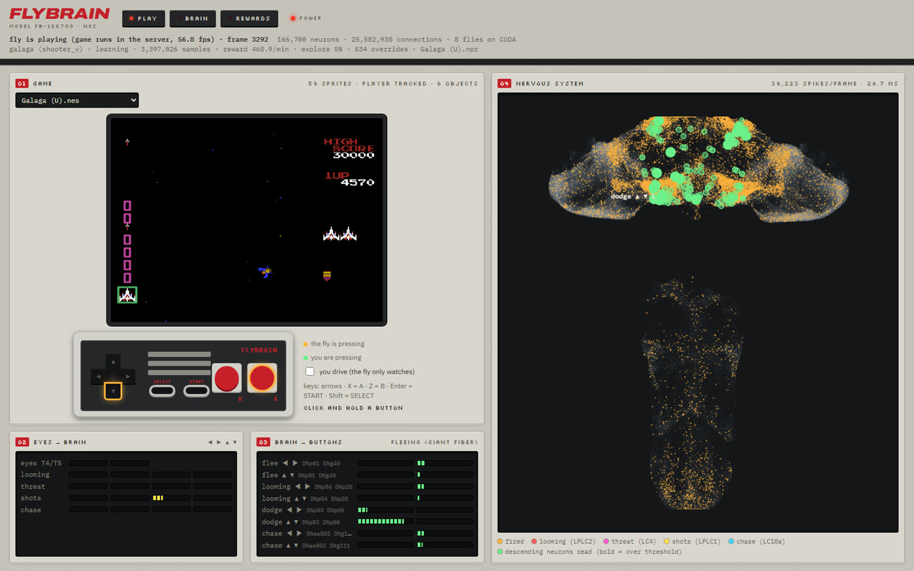

# FLYBRAIN · NES: a real fly brain plays NES games


**Demo videos:** [launch video, 20 s](docs/flybrain_launch.mp4) ·
[all videos on the release page](https://github.com/arpanguria68-ui/fly-plays-nes/releases/tag/v0.1.0)
(launch video v1 and a 2-minute walkthrough of rewards and senses)

The whole central nervous system of an adult male fruit fly (166,700 neurons, 25.6 million
connections from the [MaleCNS v1.0 connectome](https://male-cns.janelia.org), simulated live)
plays Nintendo games. Each tick (20 a second) the game picture goes into the fly's own
motion-detector neurons (T4/T5) and object detectors (LC10a, LPLC2, LC4, LPLC1). The descending
neurons, the brain's output cables to the body, then press the controller buttons. A small learner
on top rewards what scores and punishes losing a life, like food and pain teach an animal. The
brain itself stays frozen: no training inside it.

**No games are included.** You bring NES ROMs you own (see [Getting games](#getting-games)).



## What you get

* **Play** (`http://127.0.0.1:8777/`): the game, an NES controller showing what the fly presses
  (amber) and what you press (green), its eyes, its buttons and its whole nervous system firing.
  Click the pad (or use the keyboard) to play along, or tick *you drive* to take over.
* **Brain** (`/brain`): exactly what goes into the connectome each tick (the retina image, the
  voltage into every T4/T5 cell) and the spikes that come back.
* **Rewards** (`/rewards`): what the fly is rewarded and punished for, live. Change the weights,
  how strongly each sense drives the brain, let it "taste" rewards, or add your own RAM rules.
* The game runs inside the server, so it keeps playing when the tab is hidden or closed.

## Requirements

* Python 3.10 or newer (tested on 3.11, Windows 11).
* Optional: an NVIDIA GPU with a CUDA 12 driver. The brain then runs 4 voting flies per axis at
  full speed. Without a GPU it runs 1 fly per axis on the CPU (it works, just slower).
* About 300 MB of disk space for the brain. It is downloaded automatically on the first run
  (~260 MB, once) into `~/fly-data` (set `FLY_DATA` to put it somewhere else).

## Install

Windows (PowerShell):

```powershell
git clone https://github.com/arpanguria68-ui/fly-plays-nes.git
cd fly-plays-nes
py -3.11 -m venv .venv
.\.venv\Scripts\python.exe -m pip install -r requirements.txt
# with an NVIDIA GPU, also:
.\.venv\Scripts\python.exe -m pip install -r requirements-gpu.txt
```

Linux / macOS:

```bash
git clone https://github.com/arpanguria68-ui/fly-plays-nes.git
cd fly-plays-nes
python3 -m venv .venv
.venv/bin/pip install -r requirements.txt
.venv/bin/pip install -r requirements-gpu.txt   # NVIDIA GPU only
```

## Getting games

This project does not include or link to any game ROMs, and you should not commit any. Use games
you are allowed to play:

* ROMs you dumped from NES cartridges you own (with a cartridge dumper such as the INL Retro).
* Homebrew and public-domain NES games that their authors share for free.

Put the files (`.nes`, or `.zip` with a `.nes` inside) in the [`roms/`](roms/) folder, or add them
from the dashboard with **+ Add game**. Everything in `roms/` except its README is ignored by git,
so your games stay on your PC.

## Run

```powershell
.\.venv\Scripts\python.exe mesen\connect.py
```

Then open <http://127.0.0.1:8777/>. With games in `roms/`, the first one starts. Pick another from
the list at any time and the fly adapts: its controls, its own learning checkpoint, getting
through menus. With no games yet, the page says so; press **+ Add game**.

Useful options (`mesen\connect.py --help` for all):

| option | what it does |
|---|---|
| `--rom "roms\Game.nes"` | start with this game |
| `--rom-dir "D:\games"` | list the games in another folder (or set `FLY_ROMS`) |
| `--device cpu` | run the brain on the CPU even with a GPU |
| `--no-learn` | the brain alone, no learning on top |
| `--engine browser` | run the game in the page (EmulatorJS) instead of the server |
| `--dash-port 8777` | dashboard port |

Keys on the Play page: arrows, X = A, Z = B, Enter = START, Shift = SELECT.

## Which games work

Action games where the player moves on the screen work best: vertical and horizontal shooters
(Galaga), platformers (Super Mario Bros.), top-down and maze games, beat 'em ups, racing. Known
titles get their controls from `mesen/games.py`; unknown games get sensible defaults and the fly
works out which sprite it controls by itself. Sports, RPGs, puzzles and light-gun games are marked
"not suited": the fly needs moving things to react to.

Learning is saved per game in `mesen/checkpoints/` (ignored by git) and resumes next time.

## What we found (honestly)

* Real versus scrambled wiring, Super Mario Bros., 5 runs each: the real connectome covered
  3,214 px of new ground, the shuffled one 563 px (Mann-Whitney p = 0.03). Holding right with no
  brain covered 0 px (the game needs jumps).
* The learner helps in Galaga (about 3× the score, p = 0.003) but plateaus.
* The game-event reward feed and an n-step TD learner did not beat the simpler defaults in our
  tests; they are there to experiment with (`--learner td`).

## Layout

| folder | what is in it |
|---|---|
| `mesen/` | the NES fly: server, emulator bridge, learner, reward feed, the three web pages |
| `flybrain/` | the connectome simulation (from [fly.ai](https://github.com/alextitonis/fly.ai)) |
| `roms/` | your games (not in git) |
| `tests/` | `python -m pytest tests -q` (no GPU, brain data or games needed) |
| `docs/` | screenshot and demo videos |

## Credits

The connectome simulation (`flybrain/`) is from [fly.ai](https://github.com/alextitonis/fly.ai) by
alextitonis (MIT license); its full project, with more tasks for the same brain, lives there. The
brain data it downloads is built from the [MaleCNS v1.0 connectome](https://male-cns.janelia.org).
NES emulation by [cynes](https://github.com/Youlixx/cynes) (MIT). Nintendo, NES and game titles are
trademarks of their owners; this project is not affiliated with or endorsed by them.
